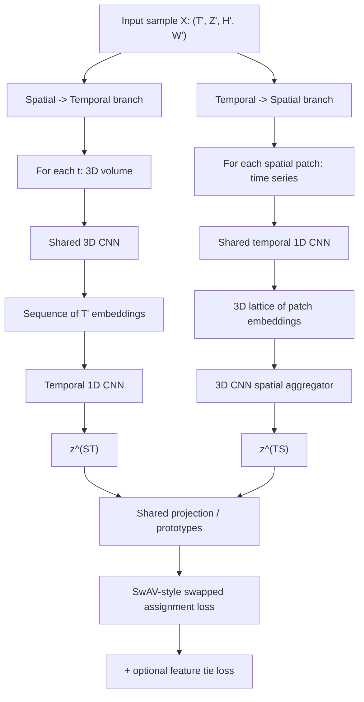

## Figures

### Figure 1. High-level architecture

```mermaid
flowchart TD
    X["Input sample X: (T', Z', H', W')"]

    X --> ST0["Spatial -> Temporal branch"]
    X --> TS0["Temporal -> Spatial branch"]

    ST0 --> ST1["For each t: 3D volume"]
    ST1 --> ST2["Shared 3D CNN"]
    ST2 --> ST3["Sequence of T' embeddings"]
    ST3 --> ST4["Temporal 1D CNN"]
    ST4 --> ZST["z^(ST)"]

    TS0 --> TS1["For each spatial patch: time series"]
    TS1 --> TS2["Shared temporal 1D CNN"]
    TS2 --> TS3["3D lattice of patch embeddings"]
    TS3 --> TS4["3D CNN spatial aggregator"]
    TS4 --> ZTS["z^(TS)"]

    ZST --> P["Shared projection / prototypes"]
    ZTS --> P
    P --> L1["SwAV-style swapped assignment loss"]
    L1 --> L2["+ optional feature tie loss"]
```
